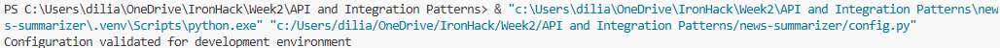
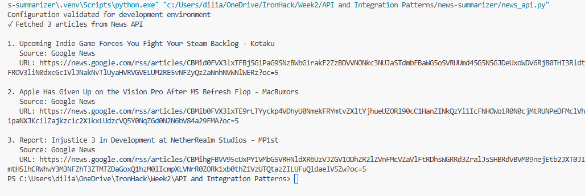
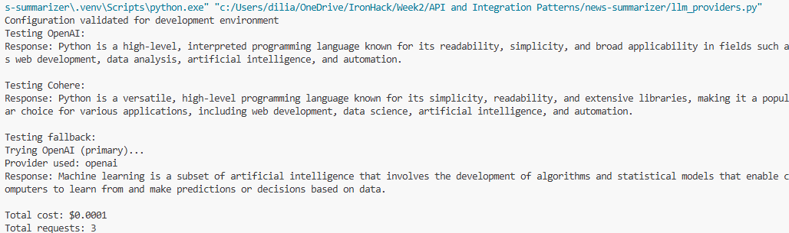
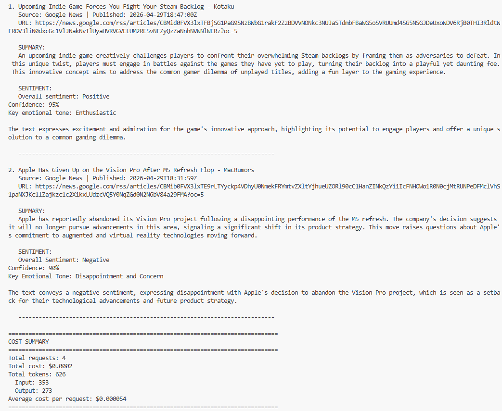
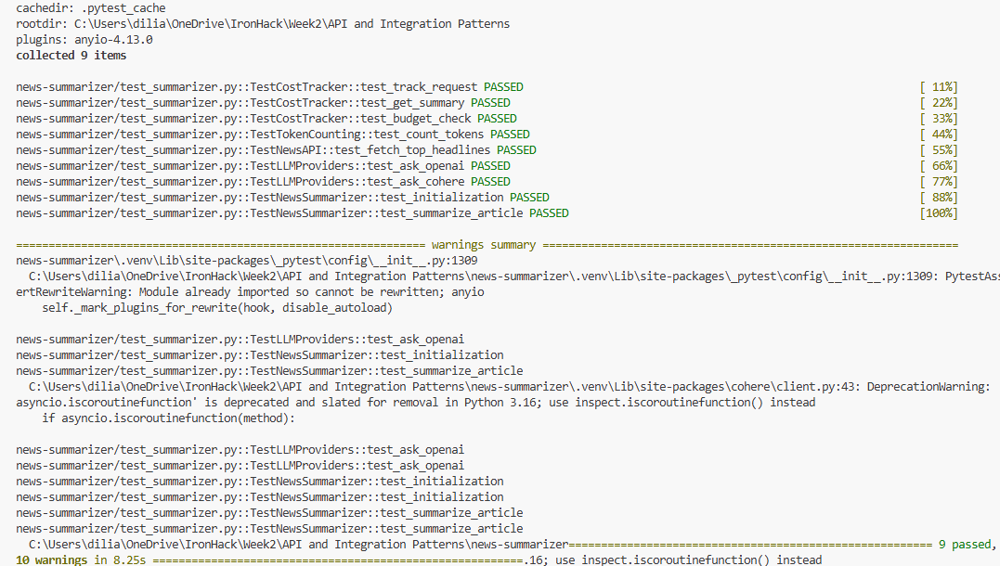
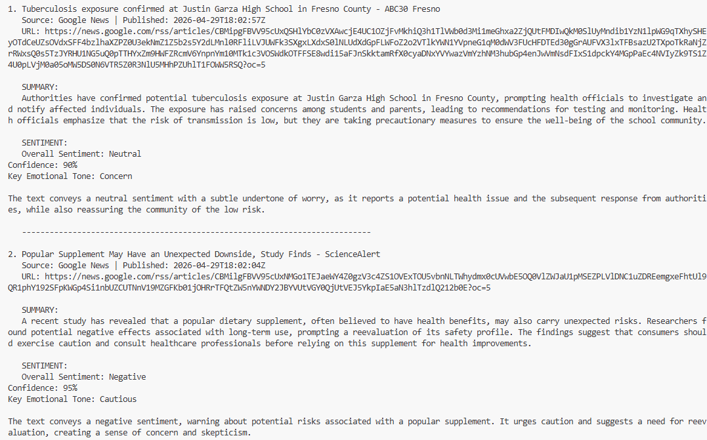
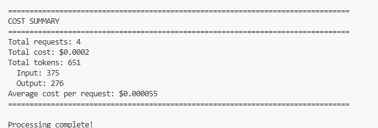

## API and Integration Patterns Lab

Working with Codex makes tasks easier and much faster to fix and review.
The main challenge I faced was related to configuration, which led me to define a Python interpreter.
It was also interesting to learn about all the steps required for setup in order to properly call an API, as well as how to work with two LLMs to keep the service available.

All steps and checks were followed. Below a brief description:

**Part1: Environment setup and Configuration**
Project structure-> Dependencies (anthropic was replaced by cohere>=5.0.0) ->.env file (OPENAI_API_KEY, COHERE_API_KEY, NEWS_API_KEY ) -> gitignore -> config.py (was amended in order to work with Cohere) -Validation was successful

Note: all codes were amended in order to work with cohere instead of anthropic

**Part2: News API Integration**
news_api.py validated

**Part3: LLM Provider Integration**
llm_providers.py => Both providers were validated. For Cohere, the model selected was: command-r-08-2024": {"input": 0.15,  "output": 0.60}

**Part4: News Summarizer Core Logic**
summarizer.py needed a fix, as the sentiment was not returned.

**Part6: Testing**
test_summarizer.py passed all tests, but also returned warnings from the cohere package and pytest cache permissions. 

**Part 7: Main Application**
main.py -> was tested few times, selecting different number of articles and subjects to analyze. At all times the response was correct.

**Checking if code follows PEP 8 style guide**
PEP8 stands for Python Enhancement Proposal and has to do with code formatting conventions.

Just reviewing with codex the main.py it does not fully fullfil PEP8 because:
*  Line 24 is 92 characters
*  Line 38 is 90 characters
According to the convention the line lenght should be max 79 characters

Everything else complies with the conventions (imports are clean, function spacing is good, naming is snake_case, indentation is correct, and docstrings are present.)